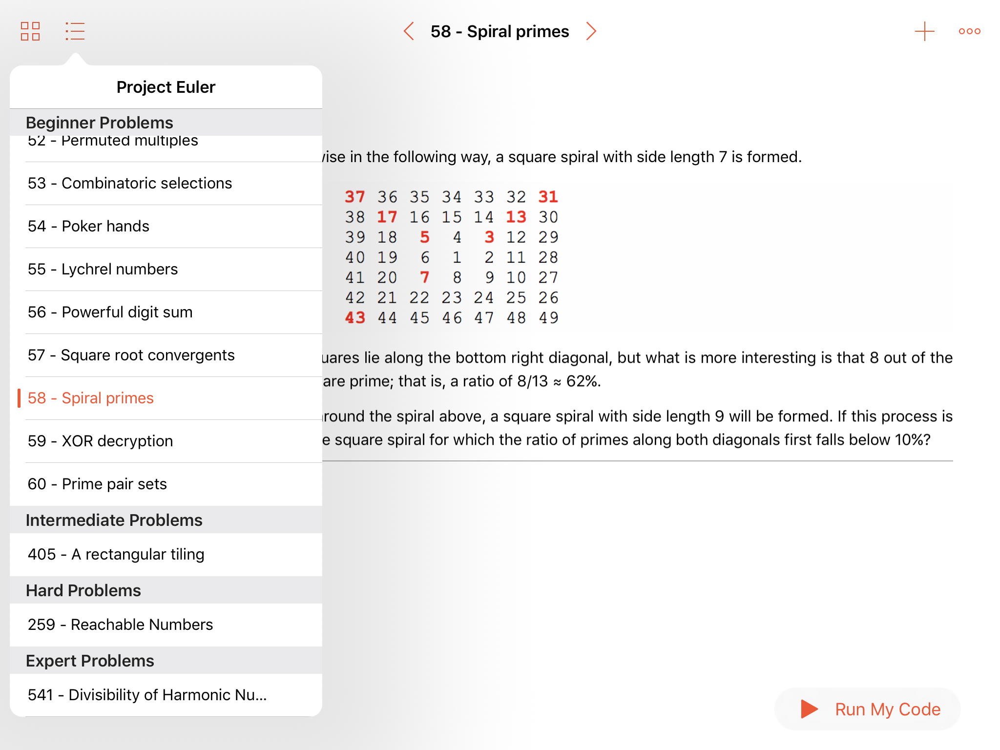

# Project Euler - Swift Playground Book

This book contains the problems from the excellent website [Project Euler](https://projecteuler.net) and brings them to [Swift Playgrounds](http://www.apple.com/swift/playgrounds/).
 
Each problem has its own page that you can solve using Swift. These pages are found in the four chapters of the book:

  1. Beginner - Difficulty levels less than 25%
  2. Intermediate - Difficulty levels between 26% and 50%
  3. Hard - Difficulty levels between 51% and 75%
  4. Expert - Difficulty levels above 76% 

This book is simply a way to relay the awesome problems that the website has available and to make it accessible to a wider audience. You can then enter the result of the problem into the website to confirm the solution and join the community of problem solvers.

*Note: Project Euler allows ([and even encourages](https://projecteuler.net/copyright)) for their material to be distributed and used for learning opportunities. What a cool bunch of people!*

## Motivation

I learnt programming by messing with these problems at university and every time I want to learn a new language I do some of these problems again to get a hang of it.

With the introduction of Swift Playground Books, Project Euler is a perfect resource to bring to new and seasoned programmers to allow them to learn Swift.

[Everyone Can Code](http://www.apple.com/education/everyone-can-code/)!

## Contribute

I am planning on adding problems slowly over the next few weeks and hopefully have a complete book soon.

Anyone is welcome and encouraged to help by:
  - Making existing problems better and more Swift Playground Book format friendly
  - Adding missing problems
  - Making the introduction HTML cutscene better
  - Adding more terms to the glossary
  - Anything else you think would make this project that much sweeter!

## Current Limitations

  - Currently links in `*.cutscenepage`s do not work. [radar-28684527](https://openradar.appspot.com/radar?id=4944870221283328)
  - GIFs do not work in the playground markdown so it makes some problems a little harder to understand. Links to the actual webpage are always available though. [radar-28684543](https://openradar.appspot.com/radar?id=4930526909562880)

## Screenshots

